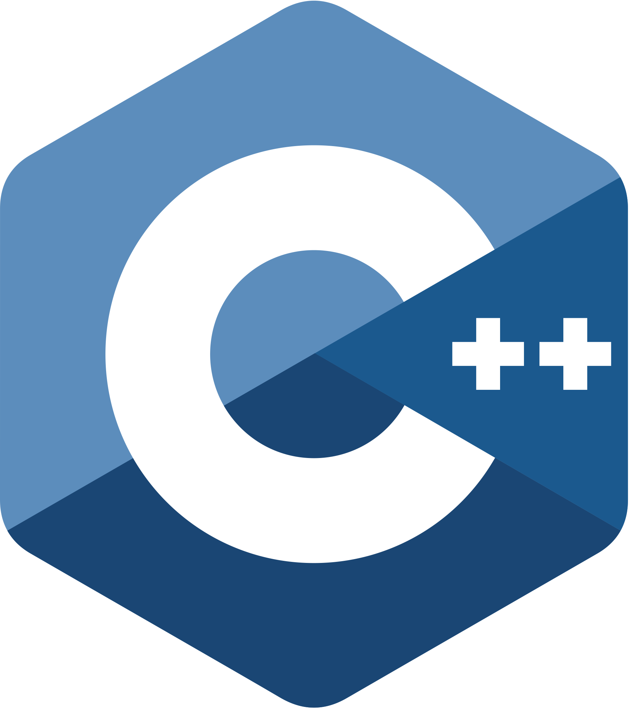
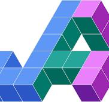
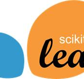
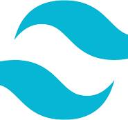
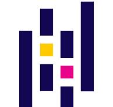
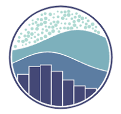

  Hi, I'm Vaibhav Tanwar, a senior at IIITD studying Computer Science and Applied Mathematics. I specialize in Deep Learning, Computer Vision, Backend engineering, Distributed Systems and Algorithms, with a keen interest in graph representation learning and efficient training/inference of large foundation models.   
   
  💬 Ask me anything about from <a href="https://github.com/Vaibtan/Vaibtan/issues" title="Issues">Here</a>
   
  📫 How to reach me: <a href="mailto: vaibhav21296@iiitd.ac.in">vaibhav21296@iiitd.ac.in</a>
   

<h2 align="center">💻 Languages Frameworks & Tools </h2>
 

  <code></code>
  <code></code>
  <code></code>
  <code></code>
  <code></code>
  <code></code>
  <code></code>
  <code></code>
  <code></code>
  <code></code>
  <code></code>
  <code></code>
  <code></code>
  <code></code>
  <code></code>
  <code></code>
  <code></code>
  <code></code>
  <code></code>
  <code></code>
  <code></code>
  <code></code>
  <code></code>
  <code></code>
  <code></code>
  <code></code>
  <code></code>
  <code></code>

 

  

    
  

 

<!--
<h2 align="center">👨‍💻 Repositories 👨‍💻</h2>
 

  

      

  
  

      

  
  

      

<h4 align="center">
  <a href="https://github.com/zumrudu-anka?tab=repositories" title="Show Repositories">🔎 Show More 🔍</a>
</h4>
-->
